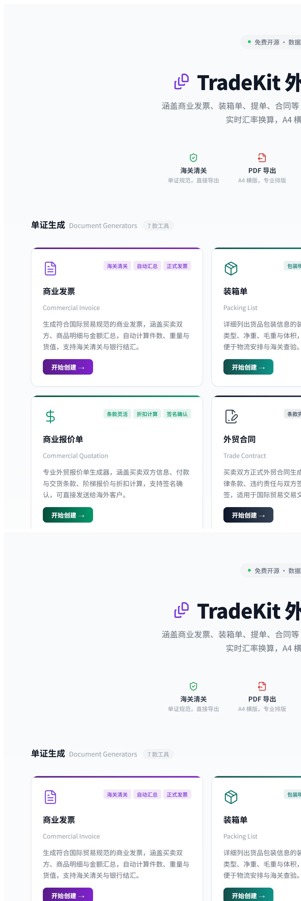
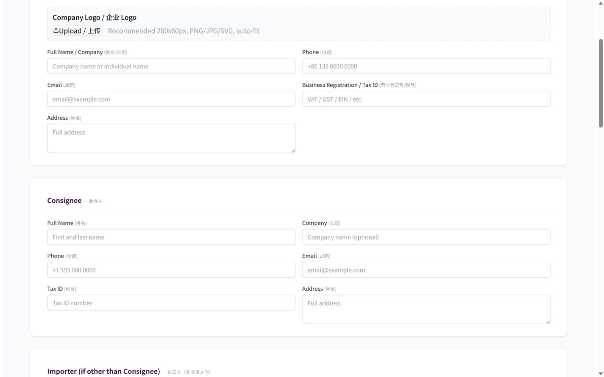
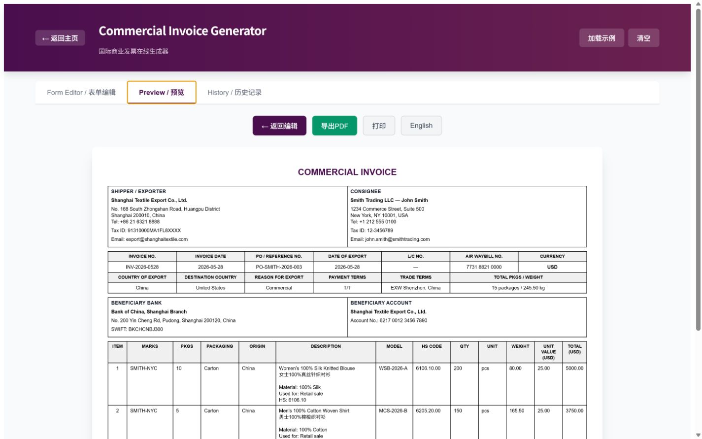

# 外贸全流程本地单证工具 PRD

版本：V1.1（范围确认稿）  
日期：2026-08-04  
状态：产品范围已确认，待进入架构与原型设计  
产品代号：TradeDesk Local（暂定）

## 1. 文档目的

本 PRD 定义一款同时支持 Windows 与 macOS、离线优先、数据本地保存的外贸业务与单证桌面软件。产品以一次建档、多单复用、跨单证一致性校验和完整历史归档为核心，覆盖从产品、客户与供应商建档、报价、形式发票、合同、采购、生产进度、履约、装箱、报关、物流、保险、认证、收款到归档的业务与单证工作流。

本稿基于对 [TradeKit](https://trade.treedeep.cn/) 主页、19 个工具页，以及代表性单证的编辑、预览和历史记录状态的逐页研究。研究时间为 2026-08-04，公开站点无需登录。

## 2. 产品结论

### 2.1 一句话定义

面向中小外贸企业、SOHO 和单证员的本地“外贸业务与单证工作台”：产品、客户、供应商和订单资料只录一次，即可跟踪采购与生产，并生成、校验、导出和追溯整套外贸单证。

### 2.2 核心价值

1. 减少重复录入：产品、客户、公司、银行和运输信息可被不同单证引用。
2. 降低错单风险：发票、装箱单、报关单、提单和唛头之间自动做一致性检查。
3. 保留完整证据链：草稿、已审核、已签发、已作废版本均可追溯，导出的 PDF 与源数据快照绑定。
4. 保护商业数据：默认不上传云端，数据库、附件、模板和备份均由用户控制。
5. 支持真实业务链：不止提供 19 个孤立工具，而是以业务单/订单为中心生成整套单证。
6. 连接销售与履约：销售订单可下推采购单，并以里程碑方式跟踪生产、质检、包装和可发货状态。

### 2.3 产品边界

本产品是“单证、采购与轻量生产跟踪工具”，不是完整 ERP、财务总账、MRP/MES、仓库 WMS 或海关正式申报客户端。首版包含供应商档案、采购单和生产里程碑，但不包含物料需求运算、车间工序排产、设备管理或库存成本核算。涉及海关、商检、银行、保险公司和船公司的正式法律文件时，软件生成申请资料或参考模板，并明确提示需由相应机构签发。

### 2.4 已确认产品决策

1. 首发同时支持 Windows 10/11 与 macOS。
2. V1.0 MVP 为单用户；V1.1 增加同一台电脑上的多账号与审核流；局域网多设备并发另列后续版本。
3. 首批模板覆盖中国出口基础模板，以及美国、欧盟、中东、东南亚和俄罗斯目的市场包。
4. V1.0 MVP 输出格式限定为 PDF、CSV 和打印；Excel/Word 放入后续版本。
5. 本地数据库默认加密，首次创建工作区时生成恢复密钥。
6. 供应商、采购和生产进度纳入 V1.0 MVP。
7. 不开发 TradeKit localStorage 历史迁移。
8. 目前没有公司现行模板；首版需建立一套专业、可打印、可配置的基准单证设计系统。

## 3. 原站研究摘要

### 3.1 已覆盖页面

- 主页：工具分类、产品卖点、FAQ、语言与深色模式。
- 单证生成：商业发票、装箱单、形式发票、商业报价单、外贸合同、成本估算单、原产地证明。
- 实用工具：汇率换算、付款条款计算器、发票编号生成器、唛头生成器。
- 物流与认证：提单、保险单、报关单、检验证书、熏蒸证书、受益人证明、发货人委托书、详细装箱单。
- 公共状态：表单编辑、示例数据、预览、PDF 导出、打印、语言切换、历史记录空状态。

### 3.2 原站可继承的设计

- 中英双语标签，英文主文档、中文辅助说明。
- 表单编辑、预览、历史记录三段式工作模式。
- 行项目表格、自动汇总、列配置、加载示例、清空等通用控件。
- A4 商业单证预览、PDF 导出与打印。
- 本地存储、无需注册、无需上传的隐私定位。
- 工具按“单证生成、实用工具、物流与认证”分类，用户容易理解。

### 3.3 原站主要缺口

- 19 个工具彼此独立，发货人、客户、产品、订单和运输信息需要重复填写。
- 历史记录按单证类型分散，无法从一笔订单查看完整单证包。
- localStorage 不适合大量附件、长期数据治理、可靠备份和复杂检索。
- 导出 PDF 时才保存快照，缺少显式草稿、审核、签发、作废和版本状态。
- 缺少产品库、客户库、合作方库、业务单/订单主记录。
- 缺少跨单证一致性检查、字段来源说明、变更影响提示。
- 多列表格在窄视口中易出现严重压缩，移动端不适合复杂制单。
- 缺少批量导入、批量生成、整套归档、加密备份和恢复验证。

## 4. 目标用户与典型任务

### 4.1 用户角色

| 角色 | 主要目标 | 典型痛点 |
|---|---|---|
| 外贸业务员 | 快速报价、跟进客户、生成 PI/合同 | 重复复制客户和产品信息，版本混乱 |
| 单证员 | 生成发票、箱单、报关和物流资料 | 不同单证字段不一致，核对耗时 |
| 物流/跟单 | 管理订舱、装箱、提单和时间节点 | 运输信息散落在文件和聊天中 |
| 财务/收款 | 管理付款条款、收款银行和应收节点 | 付款计划与订单、单证脱节 |
| 管理员/负责人 | 管理模板、编号、备份和审计 | 数据不可控，历史不可追溯 |
| 外贸 SOHO | 一人完成全流程 | 工具分散，缺少一站式本地工作台 |

### 4.2 关键用户任务

1. 从产品库和客户库快速创建一份报价单。
2. 报价确认后，复制为形式发票和合同，不重复录入。
3. 创建业务单，管理订单金额、交期、付款、运输和所需证书。
4. 从订单一键生成商业发票、装箱单、唛头、报关资料和货代委托书。
5. 自动发现发票金额与报关金额、箱单重量与提单重量等冲突。
6. 导出单份 PDF、整套 PDF/ZIP 或打印。
7. 按客户、订单、单号、产品、HS 编码、日期和状态检索历史资料。
8. 在更换电脑或故障后，从加密备份完整恢复数据库、附件和模板。

## 5. 产品目标与非目标

### 5.1 目标

- P0：覆盖原站 19 个工具的核心能力。
- P0：新增产品数据库、客户数据库、历史单证数据库。
- P0：新增供应商数据库、采购单和生产进度跟踪。
- P0：新增业务单/订单中心，实现跨单证数据复用。
- P0：支持本地数据库、附件、版本、搜索、备份与恢复。
- P0：同时支持 Windows 与 macOS。
- P0：支持中英双语单证、PDF/CSV 导出、打印和模板化。
- P0：适配中国出口、美国、欧盟、中东、东南亚和俄罗斯模板包。
- P1：增加同机多账号、审核流、付款、运输和批量导入能力。
- P1：支持整套单证包和更多数据导出能力。
- P2：可选局域网多设备协作、电子签章、外部系统连接器。

### 5.2 非目标

- 不直接替代中国国际贸易“单一窗口”等法定申报系统。
- 不承诺所生成参考证书具有政府、银行、船公司或保险机构的法律效力。
- MVP 不做完整会计凭证、总账、税务申报和自动对账。
- MVP 不做库存库位、BOM/MRP 运算、车间级排程、设备管理和复杂采购审批；仅做采购单及生产里程碑跟踪。
- MVP 不导出 Word 或 Excel 文件；结构化数据通过 CSV 提供。
- 不提供 TradeKit 浏览器 localStorage 数据迁移。
- 默认不提供云同步；云同步如未来增加，必须显式启用并独立评审安全方案。

## 6. 信息架构

主导航建议：

1. 工作台
2. 业务单
3. 产品库
4. 客户库
5. 供应商
6. 采购管理
7. 生产进度
8. 合作方
9. 单证中心
10. 工具箱
11. 模板中心
12. 数据与设置

### 6.1 工作台

- 待处理：报价待确认、合同待签、待收款、待装运、待补资料。
- 最近业务单和最近单证。
- 时间节点：交货、装运、付款、证书、信用证有效期。
- 采购与生产：待下单、待确认、生产延期、待质检、待包装、可发货。
- 数据健康：缺少 HS 编码、客户税号、供应商交期、重量异常、单证冲突、备份过期。
- 快速创建：客户、供应商、产品、报价、业务单、采购单、生产任务、单证包。

### 6.2 业务单中心

业务单是整套单证的主容器，可来源于报价、PI、合同或手工创建。一个业务单可有多次发货、多次收款和多版单证。

建议状态：线索/报价中 → 待确认 → 已确认 → 生产/备货 → 待装运 → 已装运 → 待收款 → 已完成；另有已取消、争议中、已归档。

### 6.3 单证中心

- 全部单证、按业务单、按客户、按类型、按状态、按时间筛选。
- 支持草稿、待审核、已审核、已签发、已作废、已归档。
- 支持单证包视图：报价、PI、合同、发票、箱单、物流、报关、证书、付款资料。

### 6.4 采购与生产中心

- 销售业务单可按产品、供应商或交期拆分为一张或多张采购单。
- 采购单状态：草稿 → 待确认 → 已确认 → 生产中 → 待质检 → 待包装 → 可发货 → 已完成；另有暂停、取消和异常。
- 生产进度采用里程碑和完成数量跟踪，支持计划/实际日期、完成比例、异常原因、照片和附件。
- 工作台集中显示延期、数量不足、质检未通过和包装未完成等风险。

## 7. 核心业务流程

### 7.1 首次设置

1. 创建本地工作区；数据库加密默认开启，设置工作区密码并导出恢复密钥。
2. 录入本公司资料、Logo、税号、地址、银行账户、默认签字人。
3. 设置默认语言、币种、日期格式、重量/尺寸单位、编号规则。
4. 选择备份位置和自动备份频率。
5. 导入现有产品、客户、供应商和历史单证索引；不支持 TradeKit localStorage 迁移。

### 7.2 报价到订单

1. 选择客户和联系人。
2. 从产品库添加 SKU，带出双语描述、HS 编码、规格、单位、包装和价格。
3. 设置币种、贸易术语、交货期、付款条件、有效期和折扣。
4. 生成报价单；客户确认后复制为 PI 或合同。
5. 将确认版本转为业务单，冻结关键商业快照。

### 7.3 履约到装运

1. 从业务单按供应商和交期生成采购单，发送 PDF 或打印采购资料。
2. 维护供应商确认、计划开工、生产完成、质检、包装和可发货里程碑。
3. 在业务单维护发货批次、预计/实际日期、货代、船名航次和港口。
4. 选择订单行及已完成生产数量生成发票、箱单、详细箱单和唛头。
5. 生成货代委托书、提单参考、保险资料、报关资料和所需证书。
6. 一致性检查通过后进入审核/签发。
7. V1.0 导出单份 PDF、CSV 或打印；整套单证包为 V1.1。

### 7.4 收款与归档

1. 根据付款模板生成收款节点和金额。
2. 记录实际收款日期、金额、币种、汇率、银行流水备注和附件。
3. 所有节点完成后关闭业务单。
4. 生成归档包，包含最终 PDF、源数据快照、附件清单和校验摘要。

## 8. 核心数据模型

### 8.1 公司档案 CompanyProfile

- 工作区名称、企业中英文名、统一社会信用代码/税号、注册地址、经营地址。
- 电话、邮箱、网站、Logo、印章图片、默认签字人和职务。
- 多个银行账户：币种、银行名、开户地址、SWIFT、账号、账户名、是否默认。
- 默认出口国、默认装货港、默认声明与页脚、默认贸易和付款条款。
- 数据版本、创建/修改时间、停用状态。

### 8.2 产品 Product

必填字段：产品编码/SKU、英文名称、中文名称、默认单位、状态。

建议字段：

- 型号、规格、品牌、条码、分类、标签、产品图片。
- 英文商业描述、中文描述、材质、用途、成分、技术参数。
- HS 编码，可按国家/地区维护多个编码；海关申报要素和监管条件。
- 原产国、制造商、批次/序列号规则。
- 净重、毛重、单品长宽高、默认包装类型、每箱数量、箱规、箱重、CBM。
- 默认采购成本、加工/包装/物流成本、目标利润率。
- 多币种价格表、阶梯价、客户专属价、有效期。
- 检验、熏蒸、保险、危险品、温控等标记。
- 关联证书、规格书、图片和其他附件。
- 版本号、启用/停用、创建人、修改时间。

关键规则：单证引用产品时保存业务快照；之后修改产品主数据不得静默改写已签发单证。

### 8.3 客户 Customer

- 客户编码、客户类型、状态、标签、来源、负责人。
- 法定中英文名、简称、国家/地区、税号/VAT/GST/EIN。
- 默认语言、币种、贸易术语、付款条件、信用额度和账期。
- 联系人：姓名、职务、电话、邮箱、语言、是否主要联系人。
- 地址：注册地址、账单地址、收货地址、进口人地址、通知方地址，可维护多条。
- 角色关系：Buyer、Consignee、Importer、Notify Party、Beneficiary 等。
- 客户要求：单证抬头、唛头规则、包装、标签、合规与证书要求。
- 客户专属价格、报价/订单/单证/付款/沟通附件历史。
- 合并去重、停用、创建/修改时间。

### 8.4 供应商 Supplier

- 供应商编码、法定中英文名、简称、国家/地区、税号、状态和评级。
- 联系人、地址、银行账户、结算币种、付款条款、发票类型。
- 可供产品、供应商产品编码、采购价、MOQ、阶梯价、交期和包装能力。
- 质量、交期、服务评价；资质证书、审厂报告、合同和其他附件。
- 默认制造商、生产地点、检验要求和历史采购记录。

### 8.5 采购单 PurchaseOrder

- 采购单号、供应商、来源业务单、采购币种、汇率、付款条款、交货地点。
- 采购行：销售订单行、产品快照、采购数量、单位、单价、税费和金额。
- 计划/确认交期、实际完成数量、已入待发数量、取消数量。
- 状态、供应商确认记录、付款节点、附件和变更版本。
- 一笔销售业务单可拆分到多个供应商；一张采购单可关联多个销售订单行。

### 8.6 生产进度 ProductionProgress

- 关联采购单、供应商、产品、批次和计划数量。
- 默认里程碑：原料准备、开工、生产、质检、包装、可发货；允许按供应商配置。
- 每个里程碑保存计划日期、实际日期、完成数量、完成比例、负责人和备注。
- 异常类型：延期、缺料、质量问题、返工、数量不足、包装问题、其他。
- 支持照片、质检报告和沟通附件；历史变化不可无痕覆盖。

### 8.7 合作方 Partner

统一维护货代、承运人、报关行、保险公司、银行、检验/认证机构和熏蒸服务商。字段包括名称、类型、联系人、地址、资质号、默认条款和附件。供应商和制造商使用独立的 Supplier 模型，但可与合作方档案建立关联。

### 8.8 业务单 TradeCase

- 业务单号、客户、联系人、销售负责人、来源单证。
- 币种、贸易术语、付款条款、交货日期、装运方式和港口。
- 订单行：产品快照、数量、单价、折扣、金额、重量、包装。
- 采购单、供应商分配、采购成本和生产进度汇总。
- 发货批次、集装箱/封号、运输信息、跟踪节点。
- 付款计划、收款记录、汇率快照。
- 所需单证、已有单证、校验问题、附件、备注。
- 状态、风险标记、创建/修改/关闭时间。

### 8.9 单证 Document

- document_id、document_type、document_no、business_case_id。
- customer_id、shipment_id、payment_id 等关联。
- 状态、版本号、语言、模板版本、币种。
- 表头和行项目 JSON 快照。
- 创建人、审核人、签发人、创建/修改/签发/作废时间。
- PDF 路径、附件路径、文件哈希、导出记录。
- supersedes_document_id、作废原因、标签和全文检索字段。

签发后数据默认只读；修改需“创建新版本”，原版本继续保留。

## 9. 功能需求

### 9.1 产品库

| 编号 | 需求 | 优先级 |
|---|---|---|
| PROD-01 | 新建、编辑、复制、停用产品 | P0 |
| PROD-02 | 表格/卡片视图，按 SKU、名称、HS、标签搜索 | P0 |
| PROD-03 | CSV 批量导入，提供字段映射和错误报告 | P0 |
| PROD-04 | 支持包装、重量、尺寸和 CBM 自动计算 | P0 |
| PROD-05 | 支持多币种、阶梯价和客户专属价 | P1 |
| PROD-06 | 支持附件、图片和产品版本 | P1 |
| PROD-07 | 支持从历史单证反向创建/匹配产品 | P1 |

### 9.2 客户库

| 编号 | 需求 | 优先级 |
|---|---|---|
| CUST-01 | 新建、编辑、合并、停用客户 | P0 |
| CUST-02 | 多联系人、多地址、多业务角色 | P0 |
| CUST-03 | 保存默认币种、贸易与付款条款 | P0 |
| CUST-04 | 客户 360 视图：报价、订单、单证、付款和附件 | P0 |
| CUST-05 | CSV 导入及重复检测 | P0 |
| CUST-06 | 客户专属唛头、包装、合规和模板偏好 | P1 |

### 9.3 供应商库

| 编号 | 需求 | 优先级 |
|---|---|---|
| SUP-01 | 新建、编辑、复制、停用供应商 | P0 |
| SUP-02 | 维护联系人、地址、银行、币种和付款条款 | P0 |
| SUP-03 | 建立供应商与产品、采购价、MOQ、交期的关系 | P0 |
| SUP-04 | CSV 批量导入、重复检测和错误报告 | P0 |
| SUP-05 | 保存资质、审厂、合同、质量与交期评价 | P1 |

### 9.4 采购管理

| 编号 | 需求 | 优先级 |
|---|---|---|
| PO-01 | 从销售业务单按供应商拆分创建采购单 | P0 |
| PO-02 | 采购行保留产品、数量、成本、交期和来源销售行 | P0 |
| PO-03 | 支持草稿、待确认、已确认、生产中、完成、取消状态 | P0 |
| PO-04 | 生成采购单 PDF、CSV 和打印版 | P0 |
| PO-05 | 采购数量与销售数量、生产完成量、可发货量联动 | P0 |
| PO-06 | 记录供应商确认、变更版本、付款节点和附件 | P1 |

### 9.5 生产进度

| 编号 | 需求 | 优先级 |
|---|---|---|
| PRODTRK-01 | 为采购行建立生产进度记录 | P0 |
| PRODTRK-02 | 跟踪原料、开工、生产、质检、包装、可发货里程碑 | P0 |
| PRODTRK-03 | 记录计划/实际日期、完成比例和完成数量 | P0 |
| PRODTRK-04 | 标记延期、缺料、返工、质量和数量异常 | P0 |
| PRODTRK-05 | 上传照片、质检报告和异常附件 | P0 |
| PRODTRK-06 | 工作台显示延期和阻断发货的生产风险 | P0 |

### 9.6 业务单与单证包

| 编号 | 需求 | 优先级 |
|---|---|---|
| CASE-01 | 从报价、PI、合同或手工创建业务单 | P0 |
| CASE-02 | 订单行引用产品快照，允许受控覆盖 | P0 |
| CASE-03 | 从业务单一键创建所需单证 | P0 |
| CASE-04 | 支持一次订单多批发货、多张发票、多次收款 | P0 |
| CASE-05 | 展示单证包完整度和待办节点 | P0 |
| CASE-06 | 整套导出 PDF/ZIP，并附清单 | P1 |

### 9.7 单证编辑器

建议使用桌面双栏布局：左侧为分组表单，右侧为实时 A4 预览；窄窗口切换为“编辑/预览”标签，而不是把复杂表格压缩到不可用宽度。

通用能力：

- 选择公司、客户、联系人、地址、产品、运输批次和银行账户。
- 显示每个字段来源：主数据、业务单、其他单证、手工覆盖。
- 自动保存草稿，显示最后保存时间和未保存状态。
- 行项目添加、复制、排序、批量粘贴、从产品库选择、列配置。
- 自动汇总金额、数量、件数、净重、毛重和 CBM。
- 中英双语标签；输出可选英文、中文或中英双语。
- A4 纵向/横向模板，页眉页脚、Logo、签名、印章、水印。
- V1.0 支持 PDF、CSV 和打印；Word/Excel 文件导出不在首版范围。
- 校验问题分为阻断错误、警告和提示；可跳转到字段。

### 9.8 历史单证库

| 编号 | 需求 | 优先级 |
|---|---|---|
| DOC-01 | 所有单证集中保存，不依赖导出 PDF 才生成记录 | P0 |
| DOC-02 | 草稿、审核、签发、作废和归档状态 | P0 |
| DOC-03 | 版本对比，显示字段和行项目变化 | P0 |
| DOC-04 | 按单号、客户、业务单、产品、HS、日期、状态全文检索 | P0 |
| DOC-05 | 保存源数据快照、PDF、附件和文件哈希 | P0 |
| DOC-06 | 从历史单证复制新单或新版本 | P0 |
| DOC-07 | 批量归档、标签、导出、打印 | P1 |
| DOC-08 | 保留导出记录和作废原因 | P1 |

### 9.9 模板、区域包与编号

- 为每类单证提供系统模板；用户可复制为公司模板或客户模板。
- 模板可控制字段显示、列顺序、语言、字体、颜色、Logo、签字和页脚。
- 模板版本随单证冻结，模板升级不影响旧单据。
- 因暂无公司现行模板，首版建立“专业标准、黑白打印优先、低油墨、A4 可读”的基准单证设计系统；公司可配置 Logo、字体、强调色、签字、印章和页脚。
- 首批区域模板包：中国出口基础、美国、欧盟、中东、东南亚、俄罗斯。
- 中东首批以阿联酋和沙特阿拉伯为代表配置；东南亚提供 ASEAN 通用层并优先覆盖越南、泰国、印度尼西亚、马来西亚和新加坡。
- 区域包负责字段、语言、日期/数字格式、常见证明和提示，不宣称替代当地海关、银行或认证机构的最新法定要求。
- 俄罗斯模板包支持英文/俄文可选输出、客户与地址西里尔字符、目的国字段和区域化声明；正式合规规则需在开发前由专业人员复核。
- 编号引擎覆盖所有单证类型，支持前缀、日期格式、分隔符、流水位数、按月/年重置、预览、批量预留和作废。
- 编号必须唯一；并发/多人模式需采用工作区级锁。

### 9.10 搜索与批量操作

- 全局搜索产品、客户、供应商、采购单、业务单、单证号、HS 编码、联系人和附件名。
- 结果支持类型、日期、状态、客户、供应商和标签筛选。
- 批量创建单证、批量导出、批量打印、批量归档、批量修改标签。
- 所有批量操作先展示影响范围和错误预检。

## 10. 19 个工具详细要求

### 10.1 商业发票 Commercial Invoice

原站结构：发货人/出口商、收件人、进口人、发票信息、收款银行、货品明细、备注、声明与签名；支持列配置、自动汇总、预览、PDF、打印和导出时保存历史。

关键字段：发票号/日期、PO、出口日期、AWB、L/C、币种、出口国、目的国、出口原因、付款条款、贸易术语；商品的唛头、件数、包装、原产国、描述、型号、HS、数量、单位、重量、单价、总价。

新软件增强：客户/产品/银行账户选择器；从业务单生成；金额与报关单、合同校验；重量/件数与箱单、提单校验；签发版本冻结。

### 10.2 装箱单 Packing List

原站结构：发货人、收货人、运输参考、装箱明细。行项目包含唛头、件数、包装类型、描述、数量、单位、净重、毛重、CBM。

新软件增强：从发票或发货批次生成；自动按产品包装规则拆箱；校验总数量、总件数、重量和 CBM；支持箱号范围。

### 10.3 形式发票 Proforma Invoice

原站结构：卖方、买方、PI 信息、商业条款、货品描述、声明与签名；支持 T/T、L/C、D/P、西联等付款方式和多币种。

新软件增强：从报价转 PI；有效期提醒；PI 确认后转业务单/合同；保留客户确认版本。

### 10.4 商业报价单 Commercial Quotation

原站结构：报价详情、卖方、买方、商业条款、报价项目、条款与签名。行项目支持规格、数量、单位、单价、折扣、行总价。

新软件增强：产品/客户价格带入、阶梯价、毛利预警、多个报价版本、客户接受/拒绝状态、转 PI/合同/业务单。

### 10.5 外贸合同 Trade Contract

原站结构：合同参考、卖方、买方、商业条款、法律条款、合同标的、违约条款、双方签署；包含保险、检验、不可抗力和仲裁。

新软件增强：条款模板库、变量填充、签署版本、附件、到期与交期提醒；合同金额与订单/发票校验。

### 10.6 成本估算单 Cost Estimation Sheet

原站结构：项目、公司、客户、产品概述、成本明细、条款与签名；成本行包含项目、规格、数量、单位成本、总成本和备注。

新软件增强：材料、加工、包装、国内物流、国际运费、税费、佣金、保险、汇率和利润分层；可从估算生成报价；记录采用的汇率快照。

### 10.7 原产地证明 Certificate of Origin

原站结构：出口商、收货人、运输、货品、认证；商品含唛头、件数、描述、HS、数量和毛重。

新软件增强：根据业务单和产品原产地生成申请资料；认证机构字典；明确“参考/申请稿”水印；正式证书作为附件归档。

### 10.8 汇率换算 Currency Converter

原站结构：快速换算、多币种表格、换算历史；支持手工汇率和联网获取。

新软件增强：汇率来源、抓取时间、手工/联网标识；将汇率锁定到报价、成本和收款；离线时沿用最近值并给出过期提示。

### 10.9 付款条款计算器 Payment Terms Calculator

原站预设：100% 预付、50/50、30/70、30/70 见提单副本、30/60/10、100% L/C、自定义；支持质保金天数。

新软件增强：直接生成业务单付款计划；计算到期日；记录实收和差额；逾期提醒；比例总和必须为 100%。

### 10.10 发票编号生成器 Invoice Number Generator

原站结构：编号规则、批量生成、编号记录；支持前缀、分隔符、日期、流水位数和重置规则。

新软件增强：扩展至所有单证；预留、占用、释放、作废；禁止重复；导入旧编号并检测冲突。

### 10.11 唛头生成器 Shipping Mark Generator

原站样式：标准、简约、自定义；包含收货人、目的港、PO、箱号、原产地、品名、规格、净毛重和尺寸，并提示与提单、箱单、发票保持一致。

新软件增强：从客户偏好和装箱数据生成；按箱批量生成；支持打印标签、二维码/条码；自动做单证一致性校验。

### 10.12 提单 Bill of Lading

原站结构：发货人、收货人、通知方、船名路线、运输细节、货品、汇总与声明；支持 Prepaid/Collect。

新软件增强：从发货批次和货代委托书生成提单补料；Original/Telex Release/Sea Waybill；保存船公司正式提单扫描件；校验件数、重量、CBM、港口和唛头。

### 10.13 保险单 Insurance Policy

原站结构：投保人、受益人、保单、路线、险别、货品、声明；支持海运/空运/陆运/铁路和保费计算。

新软件增强：按 CIF/CIP 和保险加成自动建议保额；区分申请稿和正式保单；归档保险公司文件与理赔附件。

### 10.14 报关单 Customs Declaration

原站结构：申报人、发货/收货人、申报详情、货品、汇总；行项目含 HS、规格、数量、单位、单价、总价、净重、毛重。

新软件增强：从发票/箱单生成报关资料；维护申报要素；校验 HS、币种、金额和重量；V1.0 导出给报关行的 CSV，Excel 模板延后；明确不是正式海关申报。

### 10.15 检验证书 Inspection Certificate

原站结构：申请人、制造商、收货人、证书、运输路线、货品、声明与认证；商品包含批次号。

新软件增强：检验标准与机构字典、批次关联、检验结果和报告附件；参考稿与正式证书分离。

### 10.16 熏蒸证书 Fumigation Certificate

原站结构：发货/收货人、商品、熏蒸信息、运输路线、证书；记录熏蒸剂、方法、温度、持续时间、地点、人员和许可证。

新软件增强：按木质包装/目的国规则提醒；服务机构档案；正式证书扫描件归档；件数、重量、体积与箱单校验。

### 10.17 受益人证明 Beneficiary Certificate

原站结构：受益人、收货人、信用证、运输和商品、声明与签署；包含 L/C、开证行、证书类型和装运信息。

新软件增强：信用证条款清单、交单截止提醒、所需证明模板和正式银行文件附件。

### 10.18 发货人委托书 Shipper's Letter of Instruction

原站结构：发货人、收货/通知方、货代与运输、保险和特殊指示、货品、汇总签署；支持 Original、Telex Release、Sea Waybill。

新软件增强：从业务单和运输批次生成；货代档案；订舱状态；回填 Booking No./B/L No.；与提单补料共享字段。

### 10.19 详细装箱单 Commercial Packing List

原站结构：发货/收货人、运输详情、装箱明细、汇总签署；行项目包含每件数量、总数量、每件净毛重、总净毛重和 CBM，支持集装箱号与封号。

新软件增强：装箱计划和实际装箱分离；自动计算箱数和 CBM；支持多个集装箱、箱号范围、托盘；生成简版箱单和唛头。

## 11. 跨单证联动与校验

### 11.1 字段来源优先级

业务单冻结快照 > 发货批次 > 客户/产品/合作方主数据 > 公司默认值 > 手工输入。

手工覆盖主数据时必须显示“已覆盖”标记，可选择回写主数据，但不得默认回写。

### 11.2 一致性规则

- 客户名称、地址、税号在发票、合同、报关和提单中的角色应一致。
- 发票、PI、合同的币种与金额需匹配，允许在分批发货场景按累计金额校验。
- 发票数量应等于相关发货批次数量，不得超过未发数量。
- 箱单、详细箱单、唛头、提单和报关资料的件数、净重、毛重、CBM 应一致。
- HS 编码、原产国、商品描述在发票、报关、原产地和保险资料中应一致。
- 船名航次、港口、装运日期在货代委托书、提单、保险和证书中应一致。
- 付款计划比例合计 100%，金额合计等于业务单金额；多币种需记录汇率。
- 日期顺序合理：报价/PI/合同、装运、签发、付款、证书有效期不得相互矛盾。

### 11.3 变更影响提示

修改客户、产品、运输或订单数据后，系统列出受影响草稿。已签发单证不自动更新，只提示创建新版本。

## 12. 状态、审核与版本

### 12.1 单证状态

- 草稿：可编辑，自动保存。
- 待审核：锁定关键字段，退回后可编辑。
- 已审核：允许签发，不允许无痕修改。
- 已签发：只读，修改需新版本。
- 已作废：保留原内容、作废人、原因和时间。
- 已归档：业务结束后的最终状态。

### 12.2 版本规则

- 同一单号可有 V1、V2；签发时固定模板版本和数据快照。
- 对比视图显示表头字段、行项目增删改和汇总变化。
- PDF 文件名建议：`客户简称_单证类型_单号_V版本_日期.pdf`。
- 导出 PDF 生成 SHA-256 哈希，记录导出时间与操作者。

## 13. 本地数据、安全与备份

### 13.1 存储

- 结构化数据：默认加密的本地 SQLite（SQLCipher 或等效方案）。
- 附件：工作区受管目录，数据库保存相对路径、元数据和哈希。
- 搜索：SQLite FTS 或等效本地全文索引。
- 不依赖浏览器 localStorage。

### 13.2 安全

- 默认无云端账户、无遥测上传。
- 数据库加密默认开启；仅允许用户在创建工作区时通过高级选项明确关闭，并展示风险说明。
- Windows 使用系统凭据存储，macOS 使用 Keychain 保存设备密钥；应用不得把明文密钥写入配置文件或日志。
- 首次创建工作区时生成恢复密钥，用户确认已保存后方可继续；恢复密钥无法由厂商找回。
- 敏感附件按工作区策略加密保存；预览或导出时使用临时文件，并在操作结束后清理。
- 隐私数据不写入普通日志；日志可导出前脱敏。
- 印章、签名和银行资料设为敏感字段，导出/复制时提示。
- 自动锁定、最近文件隐私开关、敏感附件访问记录作为 P1。

### 13.3 备份与恢复

- 手动备份和每日/每周自动备份。
- 备份包包含数据库、附件、模板、设置和清单；加密工作区的备份必须加密，不允许生成明文完整备份。
- 恢复前校验版本、哈希和可用空间；支持恢复到新工作区。
- 保留最近 N 份备份，删除前二次确认。
- 设置页显示最近成功备份时间；超过阈值在工作台预警。

### 13.4 数据迁移

- CSV：产品、客户、供应商、联系人、地址、合作方和历史索引。
- 内部工作区备份格式：完整迁移数据库、附件、模板和设置，不作为普通业务导出格式。
- PDF/图片：作为历史附件导入，可补录单号、客户、日期和类型。
- 明确不支持 TradeKit 浏览器 localStorage 迁移。

## 14. UX/UI 要求

### 14.1 桌面优先

- Windows 10/11 与 macOS 同时首发；交互遵循各平台窗口、菜单、快捷键和文件选择习惯。
- 最小支持窗口宽度建议 1100px；更窄时切换为编辑/预览标签布局。
- 复杂行项目表格支持固定首列、横向滚动、列宽调整、全屏编辑和键盘粘贴。
- 不在窄窗口中强行把 10–14 列压缩到单屏。

### 14.2 视觉与交互

- 延续原站清晰的紫色主色、绿色主操作、卡片化分组，但建立完整色彩和状态规范。
- 表单分组标题英文在前、中文辅助；输出语言独立于界面语言。
- 关键主按钮每屏只保留一个；清空、作废、覆盖、恢复等危险操作需确认。
- 空状态明确下一步，例如“从产品库添加”“导入历史单证”“设置自动备份”。
- 加载示例仅用于演示工作区，生产工作区默认不显示或放入帮助菜单。

### 14.3 可访问性

- 全键盘可操作，焦点顺序与视觉顺序一致，焦点样式明显。
- 标签与控件程序化关联，错误信息不仅依赖颜色。
- 正文和控件达到 WCAG AA 对比度目标；支持 200% 缩放。
- 点击目标不小于 36×36px，核心操作建议 44×44px。
- 表格提供语义表头、行号和可访问名称；预览与打印版区分。

## 15. 非功能需求

| 类别 | 目标 |
|---|---|
| 启动 | 常规设备冷启动 ≤ 3 秒 |
| 自动保存 | 字段修改后 1 秒内落盘；保存操作 P95 ≤ 300ms |
| 搜索 | 10 万单证、5 万产品规模下常规查询 P95 ≤ 800ms |
| PDF | 100 行以内单证 P95 ≤ 5 秒；500 行以内 ≤ 15 秒 |
| 稳定性 | 异常退出后可恢复最近自动保存草稿 |
| 数据量 | 单工作区至少支持 10 万单证、5 万产品、2 万客户 |
| 兼容性 | Windows 10/11；macOS 当前版本及前两个主要版本 |
| 跨平台一致性 | 同一工作区在 Windows 与 macOS 上的计算、PDF 版式和数据结果一致 |
| 离线 | 除实时汇率和软件更新外，核心功能完全离线 |
| 可维护性 | 数据库升级可回滚；模板、编号、校验规则有版本 |

## 16. 账号与权限方案

### 16.1 V1.0 MVP：单用户

- 单机单用户工作区，不显示复杂的用户管理界面。
- 数据模型从首版保留 created_by、reviewed_by、issued_by、audit_event 等字段，避免第二版迁移困难。
- 用户可通过工作区密码和自动锁定保护本地数据。

### 16.2 V1.1：同机多账号与审核流

V1.1 增加同一台电脑、同一工作区上的多个本地账号。账号可轮流登录，但不支持多台设备同时编辑；这样可以满足职责分离和审核留痕，同时避免提前引入网络并发与冲突合并。

角色：

- 管理员：工作区、模板、编号、备份、用户。
- 业务员：客户、报价、业务单。
- 单证员：单证生成、校验、归档。
- 审核人：审核、退回、签发、作废。
- 只读：查询和导出授权资料。

审核流：制单人提交 → 审核人审核/退回 → 授权人签发；同一账号默认不能同时完成制单与审核，管理员可配置例外并保留日志。

### 16.3 后续版本：局域网多设备

局域网多设备同时使用需要独立的服务端、并发控制、断线恢复和备份方案，不与 V1.1 同机多账号混为一体。

## 17. MVP 范围与优先级

### P0：可交付 MVP

- Windows 与 macOS 本地桌面应用、默认加密 SQLite、工作区恢复密钥。
- 公司档案、产品库、客户库、供应商库、合作方基础信息。
- 业务单、采购单、生产里程碑、发货批次、付款计划。
- 原站 19 个工具的核心字段、计算、预览、PDF、CSV 和打印。
- 单证状态、版本、历史、搜索和复制。
- 跨单证基础一致性校验。
- CSV 导入产品、客户和供应商；加密整库备份与恢复。
- 中国出口、美国、欧盟、中东、东南亚、俄罗斯首批模板包。
- 中英双语、俄文可选输出、编号规则和基准模板设计系统。

### P1：增强版

- 同机多账号、角色权限、提交/退回/审核/签发流程和审计日志。
- 客户专属价格和模板、成本报价联动。
- 整套导出、批量生成和批量打印。
- 收款记录、逾期提醒、正式文件附件归档。
- 高级区域规则和供应商绩效分析。
- 标签打印、二维码/条码。

### P2：扩展

- 局域网多设备协作和并发控制。
- 可选 Word/Excel 导出及更多行业模板。
- 可选云备份/同步、外部 ERP/CRM/邮箱/物流连接器。
- OCR 识别历史单证、AI 字段辅助与差异检查。
- 电子签章和机构接口；需单独法律与安全评审。

## 18. MVP 验收标准

### 18.1 主数据

- 可创建 1000 个产品、500 个客户和 300 个供应商并稳定搜索、筛选、导入和导出。
- 产品可保存双语描述、HS、包装、重量、尺寸、价格和附件。
- 客户可保存多联系人、多地址和默认贸易/付款条款。
- 供应商可保存供货产品、MOQ、采购价、交期、付款条款和资质附件。

### 18.2 业务与单证

- 用户能在 10 分钟内从新客户和 3 个产品创建报价并导出 PDF。
- 报价可无重复录入地转 PI、合同和业务单。
- 业务单可按供应商拆分生成采购单，并跟踪原料、生产、质检、包装和可发货里程碑。
- 系统能提示采购延期、生产异常和可发货数量不足。
- 业务单可生成发票、详细箱单、唛头、货代委托和报关资料。
- 19 个工具均可完成编辑、计算、预览、保存、复制和 PDF 导出。
- V1.0 所有业务输出均可使用 PDF、CSV 或打印完成，不依赖 Word/Excel。
- 已签发单证修改时必须创建新版本，旧版本和 PDF 不丢失。

### 18.3 校验

- 系统能发现发票与箱单数量不一致、箱单与提单重量不一致、HS 编码缺失、付款比例不等于 100%、重复单号等问题。
- 阻断错误不能签发；警告可记录理由后继续。

### 18.4 数据安全

- 无网络时除实时汇率外全部核心功能可用。
- 完整备份可在新工作区恢复，并通过记录数、附件数和哈希检查。
- 异常退出后最近草稿可恢复。
- 新建工作区默认启用数据库加密；Windows 凭据存储和 macOS Keychain 中不得出现可直接读取的业务数据。
- 同一套回归样例在 Windows 和 macOS 上生成的金额、数量、重量和版式结果一致。

## 19. 成功指标

- 生成一套“发票 + 详细箱单 + 唛头 + 货代委托 + 报关资料”的平均时间降低 60%。
- 相同客户/公司/产品信息的重复手工输入降低 80%。
- 导出前被系统发现的跨单证不一致问题数量可统计。
- 用户首次完成报价的时间 ≤ 15 分钟。
- 备份成功率 ≥ 99%，恢复演练成功率 100%。
- 默认不上传业务数据；如有使用分析，只做本地统计或显式同意后的匿名遥测。

## 20. 风险与对策

| 风险 | 对策 |
|---|---|
| “全流程”范围扩张成 ERP | 首版只做供应商、采购单和生产里程碑；不做 BOM/MRP、车间排程、库存和财务总账 |
| 不同国家单证要求差异大 | 模板和校验规则版本化，标注参考性质，允许公司/客户模板 |
| 用户误认为参考证书可正式使用 | 预览和 PDF 显示参考/申请稿标识，并要求确认 |
| 主数据更新导致旧单证变化 | 单证使用快照，签发后只读，新版本显式创建 |
| 本地设备损坏导致数据丢失 | 首次设置强提示备份，自动备份、恢复检查、备份过期提醒 |
| 宽表格在小屏不可用 | 桌面优先、横向滚动、固定列、全屏编辑，不做强压缩 |
| 加密后忘记密码 | 提供恢复密钥导出；明确无后门、不可找回的风险 |
| 同时支持两套桌面系统增加测试成本 | 共用核心业务与排版引擎，建立 Windows/macOS 双平台回归样例和签名发布流程 |
| 中东、东南亚和欧盟内部差异较大 | 区域通用层加国家配置，首版明确代表国家，不把区域模板宣传为法定合规保证 |

## 21. 决策确认记录

| 决策 | 已确认方案 | 产品处理 |
|---|---|---|
| 桌面平台 | Windows + macOS 同时首发 | 共用数据和排版内核，双平台验收 |
| 用户模式 | V1.0 单用户；V1.1 同机多账号与审核流 | 数据模型首版预留用户和审计字段 |
| 区域模板 | 中国出口、美国、欧盟、中东、东南亚、俄罗斯 | 采用区域包 + 国家配置，正式要求需专业复核 |
| 输出格式 | V1.0 仅 PDF、CSV、打印 | Word/Excel 延后 |
| 数据库加密 | 默认开启 | 系统凭据存储 + 恢复密钥 |
| 业务范围 | 首版加入供应商、采购和生产进度 | 仅轻量跟踪，不做 MRP/MES/WMS |
| TradeKit 迁移 | 不需要 | 删除 localStorage 迁移需求 |
| 现有公司模板 | 无 | 建立专业、打印优先的基准模板设计系统 |

## 附录 A：逐页研究记录与健康度

“健康”表示页面结构和核心任务清晰；“需改进”表示可用但存在数据孤岛、版本或布局问题。

| 步骤 | 页面/状态 | 主要内容 | 健康度 |
|---|---|---|---|
| 1 | 主页 | 19 个工具、三类信息架构、FAQ、本地数据定位 | 健康 |
| 2 | 商业发票 | 买卖方、进口人、银行、商品、汇总、签名 | 健康；字段最完整 |
| 3 | 装箱单 | 发货/收货、运输参考、包装与重量体积 | 需改进；与发票不联动 |
| 4 | 形式发票 | 买卖方、商业条款、商品、签名 | 健康 |
| 5 | 商业报价单 | 报价信息、折扣、条款、签名 | 健康 |
| 6 | 外贸合同 | 商业与法律条款、标的、违约、双方签署 | 健康；需条款模板治理 |
| 7 | 成本估算单 | 公司、客户、产品、成本拆分 | 健康；需与报价联动 |
| 8 | 原产地证明 | 出口商、收货人、运输、商品、认证 | 健康；参考稿定位清楚 |
| 9 | 汇率换算 | 快速换算、批量换算、历史 | 健康；需汇率来源和时间 |
| 10 | 付款条款计算器 | 预设、比例分解、付款计划 | 健康 |
| 11 | 发票编号生成器 | 规则、批量生成、编号历史 | 健康；范围应扩至所有单证 |
| 12 | 唛头生成器 | 三种样式、正唛、侧唛、复制 | 健康；需按箱打印和联动 |
| 13 | 提单 | 三方、船名路线、货品、运费、汇总 | 健康；应作为补料参考稿 |
| 14 | 保险单 | 投保、受益、路线、险别、保费 | 健康；需区分正式保单 |
| 15 | 报关单 | 申报人、贸易/运输、HS、金额、重量 | 健康；应输出报关行数据文件 |
| 16 | 检验证书 | 申请人、制造商、批次、标准和结果 | 健康；需正式报告附件 |
| 17 | 熏蒸证书 | 商品、药剂、方法、温度、时长、人员 | 健康；需机构和资质档案 |
| 18 | 受益人证明 | 受益人、L/C、银行、运输和声明 | 健康；需信用证提醒 |
| 19 | 发货人委托书 | 货代、运输、提单类型、保险、指示 | 健康；与订舱/提单应联动 |
| 20 | 详细装箱单 | 箱数、每箱数量、净毛重、CBM、箱封号 | 健康；复杂宽表需桌面优化 |
| 21 | 商业发票预览 | A4 商业版式、PDF、打印、语言切换 | 健康 |
| 22 | 商业发票历史 | 搜索、记录数、导出时自动保存快照 | 需改进；应显式保存草稿和版本 |

## 附录 B：研究证据

### 首页与工具分类

### 代表性单证编辑器

### 代表性单证预览

### 历史记录空状态

## 附录 C：研究限制

- 本次研究基于公开网页和可见交互，没有源代码、数据库结构或正式业务规则文档。
- 没有触发实际 PDF 下载、打印、清空和作废等可能产生本地状态或文件的最终动作。
- 可访问性结论仅基于可见结构和交互，未完成屏幕阅读器、完整键盘、对比度和缩放自动化测试。
- 各参考证书和提单页面并非机构正式签发系统，PRD 保留并强化这一边界。
