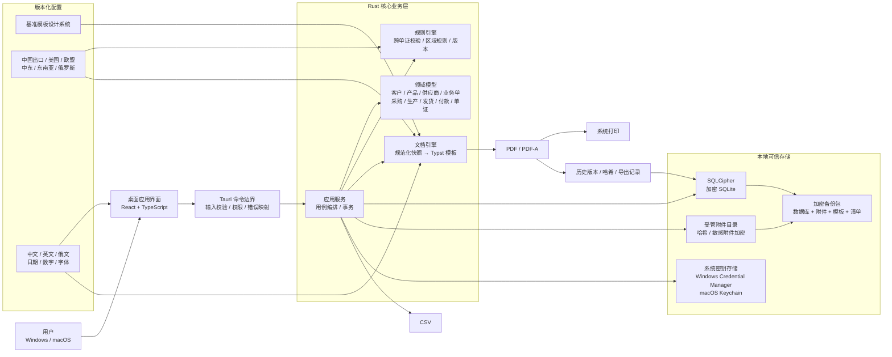
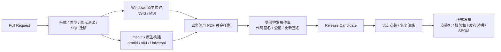
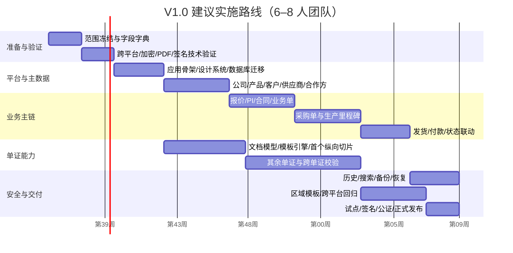
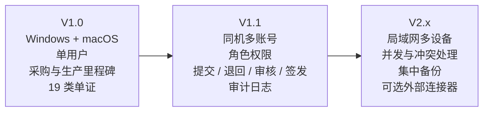

# 外贸全流程本地工具实施蓝图

版本：V1.0  
日期：2026-08-04  
输入基线：[外贸全流程本地单证工具 PRD](./PRD-外贸全流程本地单证工具.md)  
目标：同时交付 Windows 与 macOS 的单用户 V1.0 MVP，并为 V1.1 同机多账号与审核流预留架构。

## 1. 总体实施策略

采用“先打通一条真实纵向业务链，再扩展全部单证”的方式实施：

1. 先验证跨平台打包、SQLCipher 加密、Typst PDF、打印、备份恢复和签名发布。
2. 建立统一字段字典和规范化业务模型，不按 19 个工具分别建立孤立数据表。
3. 完成一条纵向切片：客户/产品/供应商 → 报价 → 业务单 → 采购单 → 生产进度 → 商业发票/详细箱单 → PDF/CSV/打印 → 历史归档。
4. 在纵向切片稳定后，把同一套数据模型和文档引擎扩展到其余 17 类单证。
5. 最后增加区域模板包、压力测试、跨平台回归、签名、安装与试点迁移。

推荐 V1.0 团队规模为 6–8 人，24–28 周完成可试点版本；少于 4 名全职研发时，应按 32–40 周估算。

## 2. 系统实施蓝图



### 架构原则

- UI 不直接访问数据库；所有写操作通过 Rust 应用服务和事务。
- 主数据与业务快照分离；产品或客户后来变化，不能静默改写已签发单证。
- 所有单证共用规范化文档模型、编号引擎、版本引擎和导出引擎。
- PDF 由确定性排版引擎生成，避免 Windows WebView2 与 macOS WebKit 产生版式差异。
- 区域规则与模板独立版本化，不能把法律或市场规则硬编码进页面组件。
- V1.0 不依赖云端服务；实时汇率和软件更新是可失败、可关闭的外围能力。

## 3. 端到端业务路径


### 关键业务控制点

| 控制点 | 阻断条件 | 通过后产物 |
|---|---|---|
| 报价确认 | 客户、币种、价格、有效期缺失 | 可转 PI/合同/业务单的报价快照 |
| 采购下单 | 供应商、数量、采购价、交期缺失 | 有版本的采购单 |
| 可发货 | 完成数量不足、质检未通过、包装未完成 | 可用于发货批次的数量 |
| 单证签发 | 重复单号、金额/数量/重量不一致、必填项缺失 | 不可变签发版本 |
| 业务关闭 | 单证未完成、收款未完成或存在未处理异常 | 完整归档包与备份记录 |

## 4. 技术路线与选型

### 4.1 推荐技术栈

| 层次 | 推荐方案 | 选择理由 |
|---|---|---|
| 桌面壳 | Tauri 2 | Windows/macOS 跨平台，安装体积较小，Rust 适合本地数据和加密边界 |
| 界面 | React + TypeScript | 表单、表格和复杂业务状态生态成熟 |
| 核心服务 | Rust stable | 类型安全、跨平台、本地性能好，便于隔离敏感数据 |
| 数据库 | SQLite + SQLCipher | 单机事务、成熟查询和全文索引；数据库文件透明加密 |
| 数据访问 | Rust Repository 层 + 显式 SQL/migrations | 避免 UI 绑定数据库结构，便于迁移和测试 |
| PDF | Typst 模板与编译引擎 | 跨平台确定性排版、字体控制、PDF/A/UA 能力 |
| CSV | Rust CSV 序列化 | 本地生成，无需办公软件依赖 |
| 打印 | 先生成最终 PDF，再调用系统打印 | 保证预览、PDF 与打印版一致 |
| 国际化 | UI 文案包 + 文档术语包分离 | 界面语言不强制等于单证输出语言 |
| 密钥 | Windows 凭据存储 / macOS Keychain | 不把工作区密钥明文写入配置文件 |
| 更新 | Tauri 签名更新包，可完全关闭 | 更新包可验证，离线客户仍可手工安装 |

Tauri 官方要求 Windows 开发环境具备 Microsoft C++ Build Tools 和 WebView2，macOS 具备 Xcode 或 Command Line Tools，并要求安装 Rust；使用前端框架时再安装 Node.js LTS。[Tauri prerequisites](https://v2.tauri.app/start/prerequisites/)

SQLCipher 是 SQLite 的专用加密构建，可对数据库页进行透明的 256 位 AES 加密。[SQLCipher security design](https://www.zetetic.net/sqlcipher/design/)

Typst 默认导出 PDF，并支持 PDF/A 与 PDF/UA 等标准；这适合同时解决跨平台版式一致性和长期归档需求。[Typst PDF documentation](https://typst.app/docs/reference/pdf/)

### 4.2 必须先做的四个技术验证

在进入大规模功能开发前，用两周完成 Architecture Spike：

1. 在 Windows 和 macOS 上打开同一加密工作区，验证 SQLCipher 建库、解锁、改密、备份和恢复。
2. 使用中文、英文、俄文和 100 行商品表生成同版 PDF，验证分页、字体嵌入、PDF/A、预览和打印。
3. 构建一条最小业务链并验证事务回滚：业务单 → 采购单 → 生产完成量 → 发货批次。
4. 在 Windows 生成安装程序，在 macOS 生成 DMG，完成签名/公证的空壳发布演练。

若任一验证失败，应在架构评审门 G1 前调整技术方案，不能把问题推迟到 19 类单证完成之后。

## 5. 实施环境

### 5.1 产品与设计环境

| 项目 | 要求 |
|---|---|
| 产品文档 | PRD、字段字典、业务规则、验收用例版本化管理 |
| 设计 | 桌面应用设计稿、表单组件库、A4 单证模板设计系统 |
| 业务样例 | 至少 3 套匿名化订单：简单订单、多供应商订单、分批发货订单 |
| 区域样例 | 中国出口基础、美国、欧盟、阿联酋/沙特、ASEAN、俄罗斯 |
| 字体 | 明确可再分发许可；覆盖简体中文、拉丁字母、西里尔字母 |
| 术语 | 中英俄术语表；客户角色、贸易术语、包装、海关和物流术语统一 |

### 5.2 Windows 开发环境

- Windows 11 x64 开发机，建议 16GB 内存、8 核 CPU、100GB 可用空间。
- Microsoft Visual Studio C++ Build Tools，“Desktop development with C++”工作负载。
- Microsoft Edge WebView2 Runtime。
- Rust stable MSVC toolchain、Node.js LTS、pnpm、Git。
- IDE：VS Code 或 RustRover；Rust Analyzer、TypeScript、格式化和静态检查扩展。
- 本机能生成并安装 NSIS/MSI 测试包。Tauri 文档说明 MSI 构建需在 Windows 上完成，跨系统构建仅应作为备用路径。[Windows installer documentation](https://v2.tauri.app/distribute/windows-installer/)

### 5.3 macOS 开发环境

- Apple Silicon Mac，建议 16GB 内存、100GB 可用空间；另保留 Intel 构建/测试能力。
- 当前 macOS 及产品支持范围内的历史版本测试环境。
- Xcode Command Line Tools；签名、公证或系统兼容测试需要完整 Xcode。
- Rust stable，安装 `aarch64-apple-darwin` 与 `x86_64-apple-darwin` 目标。
- Node.js LTS、pnpm、Git。
- Apple Developer 账号、Developer ID Application 证书、公证凭据。macOS 浏览器外分发需要签名和公证。[Tauri macOS signing](https://v2.tauri.app/distribute/sign/macos/)

### 5.4 本地运行环境

应用安装后不需要 Node、Rust、数据库服务或 Office：

- Windows：签名的 `.exe`/NSIS 为默认交付，按企业需求补 MSI。
- macOS：签名和公证的 Universal `.dmg`/`.app`。
- 数据：用户选择的本地工作区目录；数据库和附件不放在安装目录。
- 备份：本地磁盘、移动硬盘或用户选择的同步盘目录；应用本身不依赖云同步。
- 打印：操作系统可识别的打印机或系统“打印为 PDF”。

### 5.5 测试环境矩阵

| 环境 | 最低覆盖 |
|---|---|
| Windows | Windows 10 x64、Windows 11 x64；125%/150% 缩放；中文/英文系统区域 |
| macOS | 当前及前两个主要版本；Apple Silicon；Intel/Universal 构建验证 |
| 数据规模 | 5 万产品、2 万客户、3000 供应商、10 万单证、10GB 附件 |
| 语言 | 中文 UI、英文 UI；英文/中英/俄文单证输出 |
| 显示 | 1100px 最小窗口、1440p、4K/高 DPI |
| 打印 | A4 纵向/横向、黑白和彩色、分页和重复表头 |
| 安全 | 错误密码、密钥丢失、备份损坏、权限不足、磁盘满、异常退出 |
| 时区/格式 | 中国、美国、欧盟、海湾、东南亚、俄罗斯日期/数字样例 |

### 5.6 CI/CD 与发布环境



- CI 必须使用 Windows 和 macOS 原生 Runner 分别构建，不把交付构建依赖于跨编译。
- 签名证书、Apple 凭据、更新私钥只存在于受保护发布环境；普通 PR 无权读取。
- 每次发布生成安装包、SHA-256 校验和、软件物料清单、数据库迁移说明和回滚方案。
- Tauri 提供平台打包、签名和发布流程，并支持在 CI 中构建签名安装包。[Tauri distribution](https://v2.tauri.app/distribute/)、[Tauri GitHub pipeline](https://v2.tauri.app/distribute/pipelines/github/)

## 6. 推荐代码仓库路径

```text
trade-desk/
├─ apps/
│  └─ desktop/
│     ├─ src/                       # React/TypeScript UI
│     │  ├─ app/                    # 路由、工作区、错误边界
│     │  ├─ features/               # 产品、客户、供应商、采购、生产、单证
│     │  ├─ components/             # 通用表单、表格、预览、校验组件
│     │  └─ i18n/                   # UI 语言包
│     └─ src-tauri/                 # Tauri 入口、权限、平台适配
├─ crates/
│  ├─ domain/                       # 纯领域模型与规则
│  ├─ application/                  # 用例、事务、命令/查询
│  ├─ storage/                      # SQLCipher、Repository、迁移
│  ├─ document-engine/              # 规范化快照、Typst、PDF/CSV
│  ├─ security/                     # 密钥、附件、哈希、审计
│  ├─ backup/                       # 备份、恢复、完整性校验
│  └─ platform/                     # Windows/macOS 文件、打印、密钥适配
├─ packages/
│  ├─ ui/                           # 共享 UI 组件与设计令牌
│  ├─ schemas/                      # 前后端共享 DTO/字段字典
│  └─ terminology/                  # 中英俄术语表
├─ templates/
│  ├─ base/                         # 19 类基础 Typst 模板
│  ├─ markets/                      # US/EU/ME/ASEAN/RU 配置与覆盖
│  ├─ fonts/                        # 获准再分发的字体
│  └─ fixtures/                     # 模板黄金样例数据
├─ data/
│  ├─ migrations/                   # 只增不改的数据库迁移
│  ├─ seed/                         # 演示工作区
│  └─ dictionaries/                 # 国家、币种、单位、包装等字典
├─ tests/
│  ├─ unit/                         # 计算与规则
│  ├─ integration/                  # 数据库、事务、备份
│  ├─ e2e/                          # 端到端业务链
│  ├─ pdf-golden/                   # 跨平台 PDF 黄金样例
│  ├─ migration/                    # 升级/降级与损坏场景
│  └─ security/                     # 密钥、日志、临时文件和权限
├─ docs/
│  ├─ prd/
│  ├─ adr/                          # 架构决策记录
│  ├─ field-dictionary/             # 字段来源、规则和单证映射
│  ├─ runbooks/                     # 发布、恢复、证书轮换
│  └─ compliance/                   # 区域模板证据与复核记录
└─ .github/workflows/               # Windows/macOS CI 和签名发布
```

### 模块依赖规则

- `domain` 不依赖 UI、Tauri、数据库或 PDF 引擎。
- `application` 只通过接口调用存储、文档、安全和平台能力。
- 模板只能消费版本化的规范化文档快照，不能直接查询数据库。
- 市场包只能增加或覆盖字段、文案、校验和模板配置，不能复制整套业务逻辑。
- UI 只调用命令/查询 DTO，不能共享数据库实体。

## 7. 实施阶段、路径与交付物



注：文档引擎与业务主链可以并行；上图为依赖关系示意，实际项目应以两周迭代管理，不把日历日期作为合同承诺。

### Phase 0：项目准备（第 1–2 周）

任务：冻结 V1.0 范围；建立字段字典、状态机、19 类单证映射、三套匿名业务样例；确定字体和区域包代表国家。

交付物：PRD 基线、字段字典 V1、业务状态图、验收用例目录、风险清单。

门禁 G0：每个字段都有来源、类型、必填规则、快照规则和至少一个消费单证。

### Phase 1：架构验证（第 3–4 周）

任务：完成 Tauri、SQLCipher、系统密钥、Typst PDF/A、CSV、系统打印、Windows/macOS 安装与签名验证。

交付物：可安装技术样机、架构决策记录、性能基线、安全威胁模型。

门禁 G1：同一加密工作区可在双平台打开；同一输入生成版式一致 PDF；完成一次备份恢复和签名安装。

### Phase 2：平台骨架与主数据（第 5–11 周）

任务：工作区、自动保存、迁移框架、审计事件；公司、产品、客户、供应商、合作方；CSV 导入；搜索基础。

交付物：可用主数据工作台、导入错误报告、数据库迁移 V1、基础组件库。

门禁 G2：主数据可增删改查、导入、搜索、备份和恢复；数据库始终保持加密。

### Phase 3：销售、采购和生产主链（第 12–19 周）

任务：报价、PI、合同、业务单；销售行与供应商分配；采购单；生产里程碑、异常、可发货数量；付款计划和发货批次。

交付物：从报价到可发货的完整业务链、状态和异常看板。

门禁 G3：多供应商、分批生产和分批发货样例在事务、数量和状态上全部通过。

### Phase 4：文档引擎与 19 类单证（与 Phase 3 并行）

任务：规范化文档快照、编号、版本、模板、PDF/CSV/打印；先完成商业发票和详细装箱单，再扩展其余 17 类；实现跨单证校验。

交付物：19 类基础模板、黄金 PDF、校验规则、签发与作废版本。

门禁 G4：19 类单证均能编辑、预览、保存、复制、签发、导出；关键金额、数量、重量和港口规则通过。

### Phase 5：历史、安全与恢复（第 20–23 周）

任务：历史中心、版本对比、全文搜索、导出记录、加密附件、自动备份、恢复、崩溃恢复、日志脱敏。

交付物：备份恢复工具、恢复运行手册、安全测试报告。

门禁 G5：随机抽取备份可在新设备恢复；错误密码、损坏备份、磁盘满和异常退出均有可理解处理。

### Phase 6：区域模板和发布（第 24–28 周）

任务：中国出口、美国、欧盟、中东、东南亚、俄罗斯模板包；中英俄测试；性能、安装、升级、签名、公证；试点用户反馈。

交付物：Windows 安装包、macOS DMG、校验和、SBOM、发布说明、用户手册、区域包复核记录。

门禁 G6：双平台回归通过；试点完成真实订单全链；无 P0/P1 阻断缺陷；完成备份恢复演练。

## 8. 迭代与质量路径

每个两周迭代必须同时包含：

1. 一个可演示的业务结果，不以“完成数据库表”作为唯一成果。
2. 对应的领域单元测试、数据库集成测试和 UI 测试。
3. 至少一个 PDF 黄金样例；涉及模板时必须在 Windows 和 macOS 对比。
4. 数据迁移脚本和从上一版本升级的测试。
5. 安全检查：日志、临时文件、密钥和附件是否泄露。
6. 用户文档和字段字典同步更新。

### Definition of Done

- 产品验收用例通过。
- 必填、边界、异常和撤销路径有测试。
- 无直接 SQL 从 UI 发出，无敏感数据写日志。
- 新增字段已加入快照、版本对比、搜索和备份策略。
- 文档模板通过分页、字体、黑白打印和多语言检查。
- Windows 与 macOS 至少各一次安装后烟雾测试通过。

## 9. 团队配置

| 角色 | 建议投入 | 主要责任 |
|---|---:|---|
| 产品负责人/外贸业务专家 | 1 | 范围、字段、业务规则、区域模板验收 |
| UX/UI 与单证模板设计 | 1 | 桌面流程、设计系统、A4 模板、可访问性 |
| Rust/桌面核心工程师 | 2 | Tauri、领域服务、SQLCipher、安全、平台适配 |
| React/TypeScript 工程师 | 2 | 工作台、复杂表单、表格、预览、状态与国际化 |
| 测试/自动化工程师 | 1 | E2E、迁移、性能、PDF 黄金样例、双平台回归 |
| 发布/安全工程师 | 0.5 | CI、代码签名、公证、SBOM、证书和密钥管理 |
| 区域合规顾问 | 按阶段 | 美国、欧盟、中东、东南亚、俄罗斯模板复核 |

若只能配置 4 人，最低组合为：1 产品/业务、1 Rust、1 React、1 QA/设计复合角色；此时不建议并行开发全部区域包。

## 10. 上线与试点路径

1. 内部 Alpha：使用演示工作区，只验证流程与数据安全。
2. 受控 Beta：3–5 名真实用户，运行匿名化或非关键订单。
3. 试点：选择 1–2 个客户、2 个供应商和一次真实发货，全流程并行保留现有人工单证。
4. 恢复演练：把试点备份恢复到另一台 Windows 或 Mac，验证数据和附件完整性。
5. 正式发布：签名安装包、校验和、用户手册、备份策略和问题反馈渠道同时交付。
6. V1.1 启动条件：V1.0 数据模型和审计事件稳定，且试点确认存在制单与审核职责分离需求。

## 11. V1.1 与后续版本边界



V1.1 不引入服务器和局域网并发，只增加本地账号、会话切换、角色权限和审核流。多台电脑同时操作属于分布式系统问题，必须在 V2.x 独立设计。

## 12. 项目启动前必须准备的清单

### 业务与内容

- 批准后的 PRD、字段字典负责人和变更审批方式。
- 3 套匿名完整订单资料，以及覆盖 19 类单证的测试数据。
- 中国出口、美国、欧盟、中东、东南亚、俄罗斯模板复核联系人。
- 公司中英文名称、Logo、默认银行、声明、签字和印章的演示数据。

### 账号与证书

- 代码仓库和 CI 平台。
- Apple Developer 账号、Developer ID Application 证书和公证凭据。
- Windows 代码签名证书或签名服务。
- 更新包签名密钥、备份恢复密钥管理制度。

### 设备

- 至少一台 Windows 11 开发/签名机。
- 至少一台 Apple Silicon Mac 开发/签名机。
- Windows 10/11 与 macOS 支持版本的测试环境。
- A4 打印机或可重复的 PDF 打印测试环境。

### 工程基线

- Rust stable、Node.js LTS、pnpm、Git 的固定版本清单和升级策略。
- Windows C++ Build Tools/WebView2；macOS Xcode Command Line Tools。
- 获准再分发的中英俄字体文件与许可证记录。
- 依赖锁文件、漏洞扫描、SBOM、数据库迁移和发布回滚规范。

## 13. 第一批执行任务

项目批准后，首个两周迭代只执行以下工作：

1. 建立代码仓库、分支保护、Windows/macOS CI 空构建。
2. 建立 `domain`、`application`、`storage`、`document-engine` 四个核心模块边界。
3. 完成字段字典 V1 和一套“多供应商、分批发货”匿名样例。
4. 验证 SQLCipher 建库/解锁/恢复密钥。
5. 验证 Typst 中英俄字体、100 行表格、PDF/A、打印。
6. 生成未签名 Windows 与 macOS 安装包，随后完成签名方案评审。
7. 召开 G1 架构评审；通过后才进入主数据和业务模块开发。

